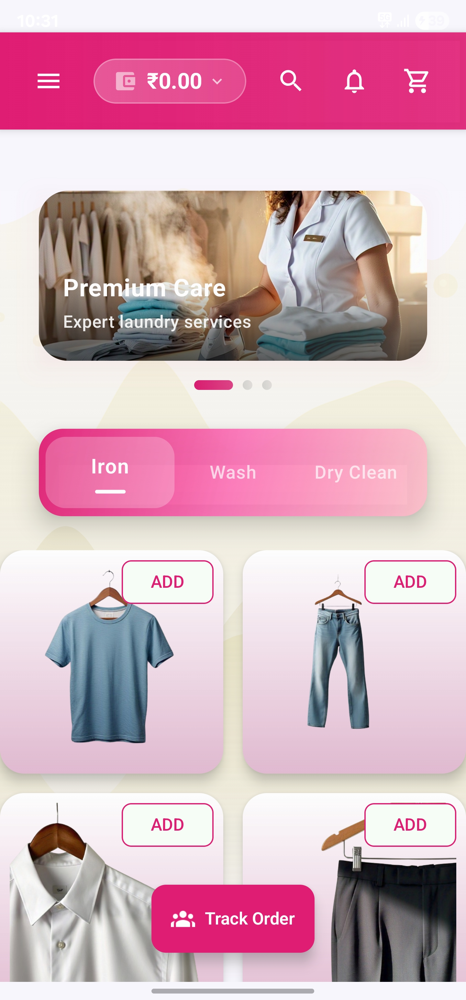
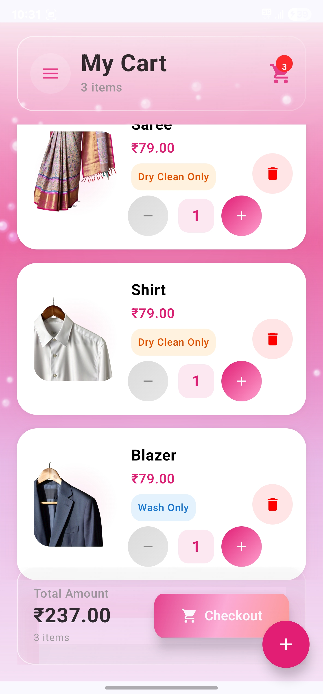
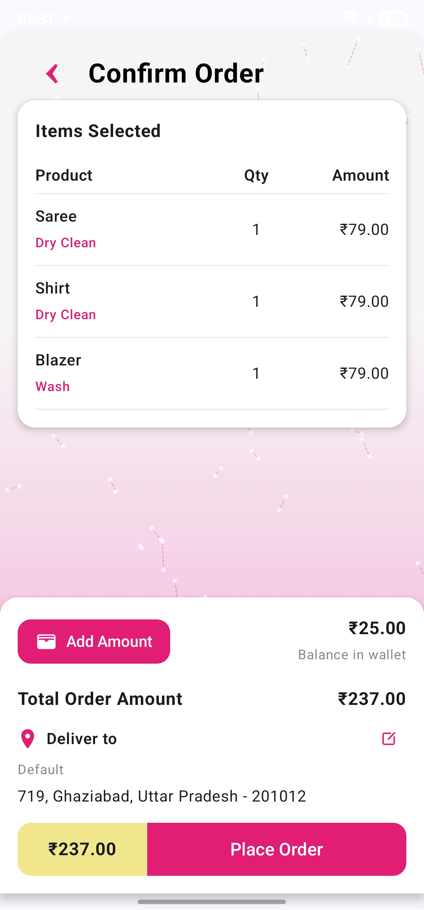
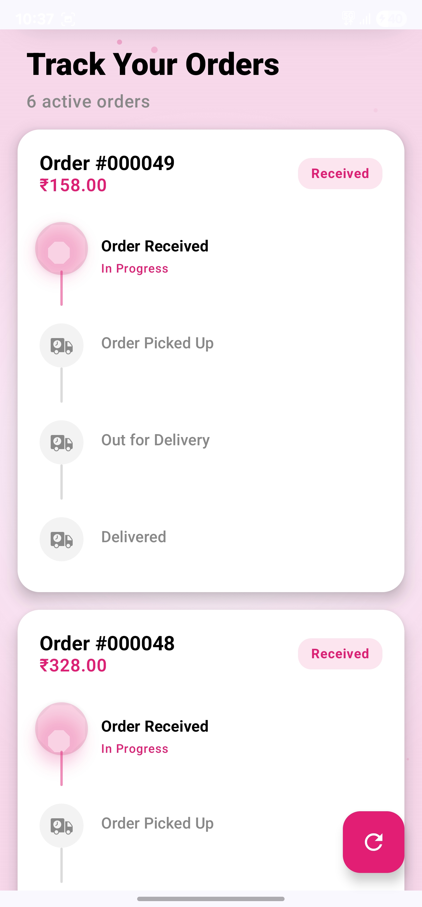
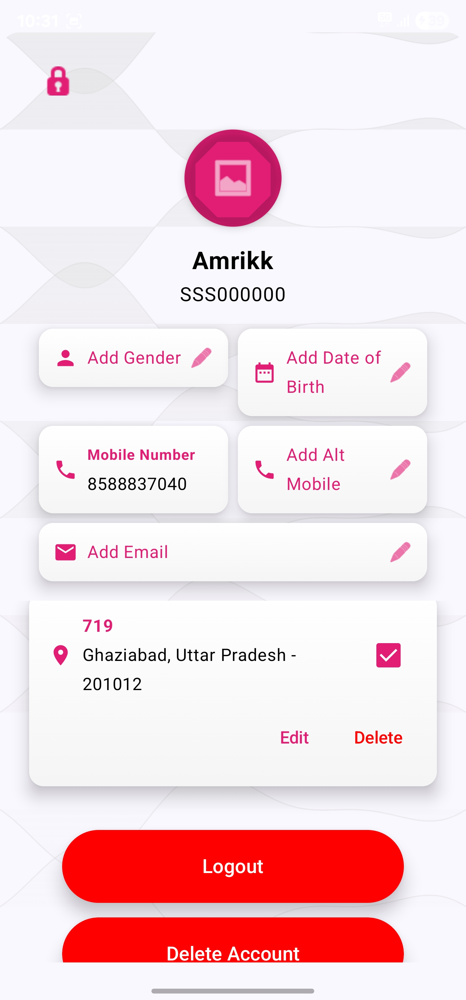
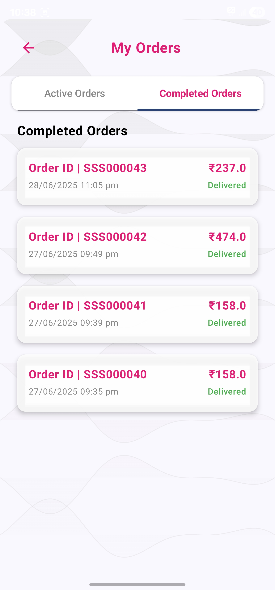

# 🧺 Momease - Laundry Service Mobile Application

**Momease** is a mobile application designed to simplify laundry management, making it **efficient, user-friendly, and seamless** for customers.

---

## 🚀 Key Features

- **Service Categories:** Iron, Wash, and Dry Clean  
- **Digital Wallet:** Easy, secure payments within the app 💳  
- **Real-time Order Tracking:** Customers can track their laundry status 📦  
- **Intuitive UI:** Modern and smooth user experience on mobile devices 📱  
- **End-to-End Development:** Designed and implemented from UI/UX to backend integration  

---

## 🛠️ Tech Stack

- **Frontend:** Android Studio (Kotlin)  
- **Backend & Database:** Firebase (Authentication, Firestore, Cloud Storage)  
- **Tools & IDE:** Android Studio, Firebase Console, Git & GitHub for version control  

---

## 📝 Project Overview

This project allowed me to:

- Work **end-to-end** on mobile application development  
- Refine **UI/UX design skills** for a smooth, modern interface  
- Implement **cloud-based solutions** for real-time data and authentication  
- Gain hands-on experience in **mobile app architecture and full-stack integration**  

---

## 📷 Screenshots

  
  
  
  
  
  
  

---

## 🎯 Learning Outcomes

- Full-cycle mobile app development with **Kotlin & Firebase**  
- Cloud integration for **real-time order tracking and user authentication**  
- Understanding of **digital wallet payment flows**  
- Collaborative development, debugging, and version control practices  

---

## 📂 Future Enhancements

- Integration of **push notifications** for order updates  
- Adding **admin panel** to manage laundry orders  
- Support for **multiple languages and regional payment methods**  
- AI-powered **laundry suggestions or sorting recommendations**  

---

## 📬 Contact

Reach out if you want to **collaborate or give feedback** on the app:  

- Email: [your.email@example.com](mailto:your.email@example.com)  
- LinkedIn: [your LinkedIn](https://www.linkedin.com/in/yourhandle)  
- Portfolio: [your Portfolio](https://your-portfolio.example.com)  

---

⭐ If you find this project useful or interesting, don’t forget to **give it a star!**
